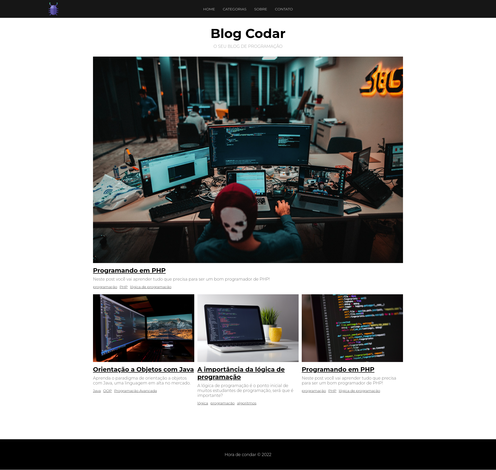

# Blog Codar

## Objetivo

Blog feito para praticar o básico do PHP aprendido no curso PHP do zero a Maestria.

Blog simples feito sem utilização de banco de dados.

<h4 align="center"> 
	🚧  Blog Codar 🚧
</h4> 

<h1 align="center">
	
</h1>

## :rocket: Tecnologias ##

Neste projeto foram utilizadas as seguintes ferramentas:

- PHP
- HTML/CSS